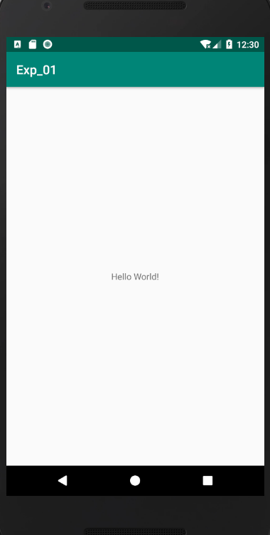
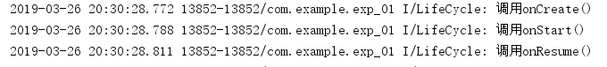
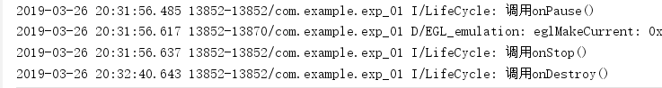

# About

**This is an HelloWorld application and android lifecircle verification.**

### 一、HelloWorld Application
 实现效果:
 

### 二、Verify Activity LifeCircle
 实现效果:
 

>onCreate（）：Activity栈中不存在当前Activity时(第一次创建/系统回收了重新创建时)调用。
>onStart（）：Activity被激活，此状态Activity为不可见并且不能和用户交互。
>onResume（）：Activity已经可见且可以和用户进行交互了。
>onPause（）：Activity被暂停活动，此状态Activity已经失去用户焦点，无法进行交互但是任然可见。
>onStop（）：Activity被完全停止，无法和用户交互并且不可见。
>onDestory（）：Actiivty被销毁了，并从Activity栈中压出。
>onRestart（）：Activity被重新激活，一般出现在重新回到前台时调用

-------------------------------

# end

